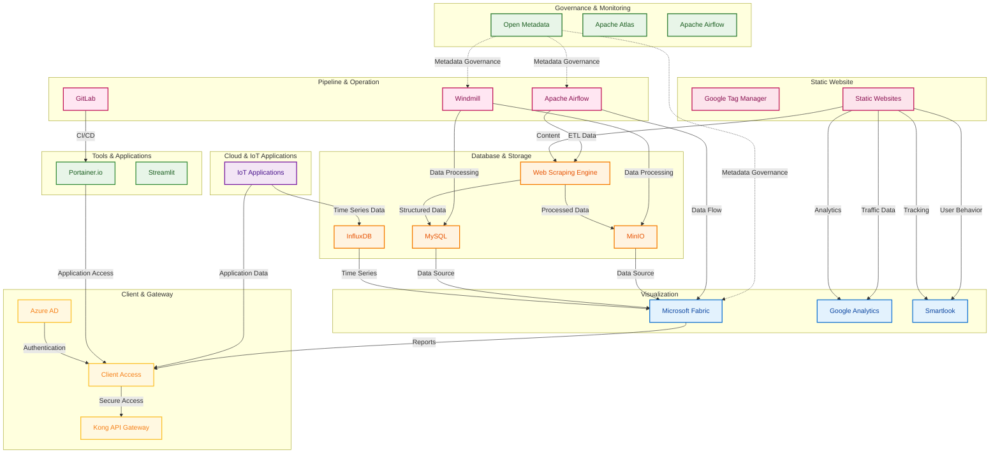

# Data Platform Architecture

## Overview

This document outlines the comprehensive data platform architecture I've designed and implemented to support our organization's data governance, pipeline automation, storage, visualization, and client access requirements. The system is built with modern cloud-native technologies and follows best practices for data engineering and security.

## Architecture Layers

### 1. Governance & Monitoring Layer

The top-level governance layer provides centralized control and management of the entire data platform using Open Metadata. This layer ensures data quality, compliance, and operational oversight across all system components.

**Key Components:**
- **Open Metadata**: Central metadata management and governance
- **Apache Atlas**: Data lineage and governance tracking
- **Prometheus & Grafana**: System monitoring and alerting

### 2. Pipeline & Operation Layer

This layer handles automated data pipeline operations, including Extract-Transform-Load (ETL) processes from various data sources including IoT devices and applications, with data flowing to the data warehouse.

**Key Components:**
- **Apache Airflow**: Primary workflow orchestration engine
- **Windmill**: Alternative workflow automation tool
- **GitLab**: Version control and CI/CD pipeline management

### 3. Data Sources & Ingestion Layer

This layer handles data collection and ingestion from various sources including IoT devices, web scraping, and external applications.

**Key Components:**
- **Web Scraping Engine**: Converts websites into LLM-ready data
- **IoT Data Collectors**: Real-time data collection from IoT devices
- **API Integrations**: External data source connections
- **Data Validation**: Quality checks and data validation

### 4. Database & Storage Layer

The storage layer manages both structured and unstructured data with specialized components for different data types.

**Key Components:**
- **MySQL**: Primary relational database for structured data
- **MinIO**: Object storage for unstructured data and files
- **InfluxDB**: Time-series database for IoT and sensor data
- **MongoDB**: Document database for flexible schema data

### 5. Data Processing & Analytics Layer

This layer provides data processing, transformation, and analytics capabilities.

**Key Components:**
- **Microsoft Fabric**: Comprehensive data platform including:
  - Data Factory for ETL orchestration
  - Data Warehouse for analytical processing
  - Data Engineering for transformation logic
  - Real-Time Analytics for streaming data
  - Power BI for interactive dashboards
- **Apache Spark**: Big data processing and analytics
- **Data Quality Tools**: Data validation and cleansing

### 6. Visualization & Reporting Layer

This layer provides data visualization and business intelligence capabilities.

**Key Components:**
- **Power BI**: Interactive dashboards and reports
- **Google Analytics**: Web traffic analysis and user behavior
- **Smartlook**: User session recording and heatmaps
- **Custom Dashboards**: Real-time monitoring dashboards

### 7. IoT & Edge Computing Layer

This layer encompasses various IoT applications and edge computing services that generate and process data at the edge.

**Key Components:**
- **Smart City Applications**: Smart Parking, Smart Waste, Smart Pole
- **Smart Agriculture**: Smart Farm monitoring and automation
- **Smart Building**: Smart Home and Smart Office systems
- **Healthcare IoT**: Exoskeleton and medical device monitoring
- **Edge Computing**: Local data processing and analytics
- **People Counting**: Traffic and occupancy analytics

### 8. Development & Operations Layer

Development and deployment tools that support the platform's operational needs.

**Key Components:**
- **Portainer.io**: Container management for production and development environments
- **Streamlit**: Web application framework for data applications
- **GitLab CI/CD**: Automated deployment and testing
- **Monitoring Tools**: Application performance monitoring

### 9. Security & Access Management Layer

Security and access management layer that handles both internal and external access with proper authentication and authorization.

**Key Components:**
- **Kong API Gateway**: API management, routing, and rate limiting
- **Azure AD**: Identity and access management with SSO
- **Client Access**: Secure GUI access for authorized users
- **Network Security**: Firewall and intrusion detection

### 10. Web Presence & Analytics Layer

Web presence management with traffic tracking and tag management capabilities.

**Key Components:**
- **Google Tag Manager**: Tag management for static websites
- **Static Websites**: Various organizational websites (nccthailand, qsncc, EO website)
- **Web Analytics**: Traffic monitoring and user behavior analysis

## Data Flow Architecture

## Security Architecture

The platform implements a multi-layered security approach:

1. **API Gateway Security**: Kong API Gateway manages all external access
2. **Identity Management**: Azure AD provides centralized authentication
3. **Data Governance**: Open Metadata ensures data lineage and compliance
4. **Access Control**: Role-based access control for different user types
5. **Secure Routes**: All client access goes through proper authentication channels

## Data Flow Patterns

- **Green Dashed Lines**: Secure client access via GUI with best practices
- **Purple Dashed Lines**: Server-to-server integration
- **Dark Purple Dashed Lines**: Metadata governance connections
- **Red Dashed Lines**: Direct access routes (not recommended)
- **Black Dashed Lines**: Planning and coordination flows
- **Black Double-Headed Lines**: Two-way communication

## Technology Stack

### Cloud Services
- Microsoft Fabric (Data Factory, Warehouse, Power BI)
- Azure AD (Identity Management)
- Google Analytics & Tag Manager
- Smartlook (User Analytics)

### On-Premise Infrastructure
- Nutanix (Infrastructure Platform)
- GitLab (Version Control)
- Portainer.io (Container Management)

### Data Technologies
- MySQL (Relational Database)
- InfluxDB (Time-Series Database)
- MinIO (Object Storage)
- MongoDB (Document Database)

### Orchestration & Automation
- Apache Airflow (Workflow Orchestration)
- Windmill (Alternative Automation)
- Apache Atlas (Data Lineage)

### Security & Access
- Kong API Gateway
- Azure AD
- Open Metadata

## Implementation Notes

This architecture was designed to handle the complexity of modern data operations while maintaining security, scalability, and operational efficiency. The system supports both real-time and batch processing requirements, with proper governance and monitoring throughout the data lifecycle.

The platform is built to accommodate future growth and technology evolution, with modular components that can be independently scaled and updated as needed.
