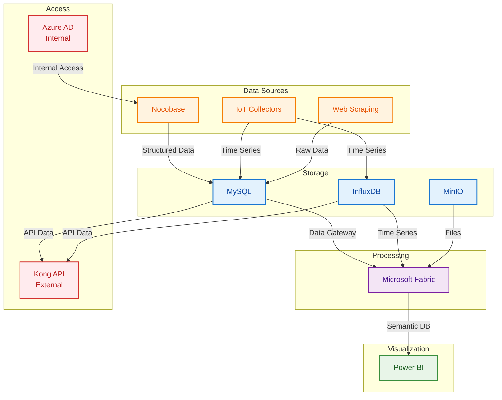

# Data Platform Architecture

## Overview

This document outlines the comprehensive data platform architecture I've designed and implemented to support our organization's data governance, pipeline automation, storage, visualization, and client access requirements. The system is built with modern cloud-native technologies and follows best practices for data engineering and security.

## Architecture Layers

### 1. Governance & Monitoring Layer

The top-level governance layer provides centralized control and management of the entire data platform using Open Metadata. This layer ensures data quality, compliance, and operational oversight across all system components.

**Key Components:**
- **Open Metadata**: Central metadata management and governance
- **Prometheus & Grafana**: System monitoring and alerting

### 2. Pipeline & Operation Layer

This layer handles automated data pipeline operations, including Extract-Transform-Load (ETL) processes from various data sources including IoT devices and applications, with data flowing to the data warehouse.

**Key Components:**
- **Windmill**: Primary workflow orchestration engine for ETL processes
- **Apache Airflow**: Alternative workflow automation tool (Not in Use)
- **GitLab**: Version control and CI/CD pipeline management (Not Available)

### 3. Data Sources & Ingestion Layer

This layer handles data collection and ingestion from various sources including IoT devices, web scraping, and external applications.

**Key Components:**
- **Nocobase**: Low-code application platform for data input and collection
- **Web Scraping Engine**: Converts websites into LLM-ready data
- **IoT Data Collectors**: Real-time data collection from IoT devices
- **API Integrations**: External data source connections
- **Data Validation**: Quality checks and data validation

### 4. Database & Storage Layer

The storage layer manages both structured and unstructured data with specialized components for different data types.

**Key Components:**
- **MySQL**: Primary relational database for structured data
- **MinIO**: Object storage for unstructured data and files
- **InfluxDB**: Time-series database for IoT and sensor data
- **MongoDB**: Document database for flexible schema data (Pending Implementation)

### 5. Data Processing & Analytics Layer

This layer provides data processing, transformation, and analytics capabilities.

**Key Components:**
- **Microsoft Fabric**: Comprehensive data platform including:
  - Data Factory for ETL orchestration
  - Data Warehouse for analytical processing
  - Data Engineering for transformation logic
  - Real-Time Analytics for streaming data
  - Power BI for interactive dashboards

### 6. Visualization & Reporting Layer

This layer provides data visualization and business intelligence capabilities.

**Key Components:**
- **Power BI**: Interactive dashboards and reports
- **Google Analytics**: Web traffic analysis and user behavior
- **Smartlook**: User session recording and heatmaps
- **Custom Dashboards**: Real-time monitoring dashboards

### 7. IoT & Edge Computing Layer

This layer encompasses various IoT applications and edge computing services that generate and process data at the edge.

**Key Components:**
- **IoT Data Sources**: Various IoT devices and sensors including:
  - Smart City applications (Parking, Waste, Poles)
  - Smart Agriculture and Building systems
  - Healthcare and medical devices
  - People counting and traffic analytics
- **Edge Computing**: Local data processing and analytics

### 8. Application Layer

This layer contains various business applications and automation tools that support organizational operations.

**Key Components:**
- **n8n**: Workflow automation and integration platform
- **Dify**: AI application development platform
- **Internal Access**: All applications accessible via Azure AD

### 9. Development & Operations Layer

Development and deployment tools that support the platform's operational needs.

**Key Components:**
- **Portainer.io**: Container management for production and development environments
- **Streamlit**: Web application framework for data applications
- **GitLab CI/CD**: Automated deployment and testing
- **Monitoring Tools**: Application performance monitoring

### 10. Security & Access Management Layer

Security and access management layer that handles both internal and external access with proper authentication and authorization.

**Key Components:**
- **Kong API Gateway**: API management, routing, and rate limiting (External Access)
- **Azure AD**: Identity and access management with SSO (Internal Access)
- **Client Access**: Secure GUI access for authorized users
- **Network Security**: Firewall and intrusion detection

### 11. Web Presence & Analytics Layer

Web presence management with traffic tracking and tag management capabilities.

**Key Components:**
- **Google Tag Manager**: Tag management for static websites
- **Static Websites**: Various organizational websites (nccthailand, qsncc, EO website)
- **Web Analytics**: Traffic monitoring and user behavior analysis

## Data Flow Architecture

### Core Data Flow (Simplified View)

*Simplified view showing main data flow from sources to visualization*

### Detailed Architecture (Full View)

*Complete 11-layer architecture with all components and connections*

```mermaid
graph TB
    subgraph "Governance & Monitoring"
        OM[Open Metadata]
        PG[Prometheus & Grafana]
    end

    subgraph "Pipeline & Operation"
        WM[Windmill<br/>Primary ETL]
        AIR[Apache Airflow<br/>Not in Use]
        GL[GitLab<br/>Not Available]
    end

    subgraph "Data Sources & Ingestion"
        NOC[Nocobase]
        WSE[Web Scraping Engine]
        IOT[IoT Data Collectors]
        API[API Integrations]
    end

    subgraph "Database & Storage"
        MYSQL[MySQL]
        MINIO[MinIO]
        INFLUX[InfluxDB]
        MONGO[MongoDB<br/>Pending]
    end

    subgraph "Data Processing & Analytics"
        MF[Microsoft Fabric]
    end

    subgraph "Visualization & Reporting"
        PBI[Power BI]
        GA[Google Analytics]
        SL[Smartlook]
    end

    subgraph "IoT & Edge Computing"
        IOT_SOURCES[IoT Data Sources]
        EDGE[Edge Computing]
    end

    subgraph "Application"
        N8N[n8n]
        DIFY[Dify]
    end

    subgraph "Development & Operations"
        PORT[Portainer.io]
        ST[Streamlit]
        MON[Monitoring Tools]
    end

    subgraph "Security & Access"
        KONG[Kong API Gateway<br/>External]
        AAD[Azure AD<br/>Internal]
        NS[Network Security]
    end

    subgraph "Web Presence & Analytics"
        GTM[Google Tag Manager]
        SW[Static Websites]
        WA[Web Analytics]
    end

    %% Core Data Flow (Simplified)
    IOT_SOURCES -->|Sensor Data| IOT
    IOT -->|Time Series| INFLUX
    IOT -->|Time Series| MYSQL
    NOC -->|Structured Data| MYSQL
    NOC -->|Files| MINIO
    NOC -->|Documents| MONGO
    WSE -->|Raw Data| MYSQL
    WSE -->|Files| MINIO
    API -->|Structured Data| MYSQL
    API -->|Documents| MONGO

    %% Processing Flow
    MYSQL -->|On-Premises Data Gateway| MF
    MINIO -->|Files| MF
    INFLUX -->|Time Series| MF
    MONGO -->|Documents| MF
    MF -->|Semantic DB| PBI

    %% ETL Orchestration
    WM -->|ETL Orchestration| WSE
    WM -->|ETL Orchestration| IOT
    WM -->|ETL Processing| MYSQL
    WM -->|API Processing| KONG

    %% External API Access
    MYSQL -->|API Data| KONG
    INFLUX -->|API Data| KONG
    MINIO -->|API Data| KONG
    MONGO -->|API Data| KONG

    %% Internal Access
    AAD -->|Internal Access| N8N
    AAD -->|Internal Access| DIFY
    AAD -->|Internal Access| NOC

    %% Application Data Access
    MYSQL -->|Structured Data| N8N
    MYSQL -->|Structured Data| DIFY
    INFLUX -->|Time Series Data| N8N
    INFLUX -->|Time Series Data| DIFY
    MINIO -->|File Storage| N8N
    MINIO -->|File Storage| DIFY
    MONGO -->|Document Data| N8N
    MONGO -->|Document Data| DIFY

    %% Governance & Monitoring
    OM -.->|Metadata Governance| WM
    OM -.->|Metadata Governance| MF
    PG -->|Monitoring| WM
    PG -->|Monitoring| MF

    %% Web Analytics
    SW -->|Traffic Data| GA
    SW -->|User Behavior| SL
    SW -->|Content| WSE
    SW -->|Analytics| GA
    SW -->|Tracking| SL

    %% Security & External Access
    PBI -->|Secure Access| KONG
    PORT -->|API Access| KONG
    GL -->|CI/CD| PORT

    %% Styling with better contrast
    classDef governance fill:#E8F5E8,stroke:#2E7D32,stroke-width:2px,color:#1B5E20
    classDef pipeline fill:#FFE6F2,stroke:#C2185B,stroke-width:2px,color:#880E4F
    classDef ingestion fill:#FFF3E0,stroke:#F57C00,stroke-width:2px,color:#E65100
    classDef storage fill:#E3F2FD,stroke:#1976D2,stroke-width:2px,color:#0D47A1
    classDef processing fill:#F3E5F5,stroke:#7B1FA2,stroke-width:2px,color:#4A148C
    classDef visualization fill:#E8F5E8,stroke:#388E3C,stroke-width:2px,color:#1B5E20
    classDef iot fill:#FFF8E1,stroke:#FBC02D,stroke-width:2px,color:#F57F17
    classDef devops fill:#FCE4EC,stroke:#C2185B,stroke-width:2px,color:#880E4F
    classDef security fill:#FFEBEE,stroke:#D32F2F,stroke-width:2px,color:#B71C1C
    classDef web fill:#E0F2F1,stroke:#00695C,stroke-width:2px,color:#004D40
    classDef application fill:#F1F8E9,stroke:#689F38,stroke-width:2px,color:#33691E

    class OM,PG governance
    class AIR,WM,GL pipeline
    class NOC,WSE,IOT,API ingestion
    class MYSQL,MINIO,INFLUX,MONGO storage
    class MF processing
    class PBI,GA,SL visualization
    class IOT_SOURCES,EDGE iot
    class N8N,DIFY application
    class PORT,ST,MON devops
    class KONG,AAD,NS security
    class GTM,SW,WA web
```

## Architecture Screenshots

### How to Generate Screenshots

To create high-quality screenshots of the Mermaid diagrams:

1. **Using Mermaid Live Editor:**
   - Go to https://mermaid.live/
   - Copy the Mermaid code from below
   - Adjust theme and styling
   - Export as PNG (1920x1080 recommended)

2. **Using GitHub:**
   - The diagrams render automatically in GitHub
   - Use browser screenshot tools
   - Capture each diagram separately

3. **Recommended Screenshots:**
   - `core-data-flow.png` - Simplified data flow
   - `detailed-architecture.png` - Full 11-layer architecture
   - `security-architecture.png` - Security and access patterns
   - `technology-stack.png` - Technology components overview

### Screenshot Gallery

*Simplified data flow showing main components and connections*

*Complete 11-layer architecture with all components*

*Security and access management patterns*

*Overview of all technology components*

## Security Architecture

The platform implements a multi-layered security approach:

1. **API Gateway Security**: Kong API Gateway manages external API access from database through Windmill
2. **Identity Management**: Azure AD provides centralized authentication for internal applications
3. **Data Governance**: Open Metadata ensures data lineage and compliance
4. **Access Control**: Role-based access control for different user types
5. **Secure Routes**: Internal applications access through Azure AD, external access through Kong API Gateway

## Data Flow Patterns

- **Green Dashed Lines**: Secure client access via GUI with best practices
- **Purple Dashed Lines**: Server-to-server integration
- **Dark Purple Dashed Lines**: Metadata governance connections
- **Red Dashed Lines**: Direct access routes (not recommended)
- **Black Dashed Lines**: Planning and coordination flows
- **Black Double-Headed Lines**: Two-way communication

## Technology Stack

### Governance & Monitoring
- Open Metadata (Central metadata management)
- Prometheus & Grafana (System monitoring)

### Pipeline & Orchestration
- Windmill (Primary ETL orchestration engine)
- Apache Airflow (Alternative automation - Not in Use)
- GitLab (Version control and CI/CD - Not Available)

### Data Sources & Ingestion
- Nocobase (Low-code application platform for data input and collection)
- Web Scraping Engine (LLM-ready data conversion)
- IoT Data Collectors (Real-time sensor data)
- API Integrations (External data sources)

### Storage & Databases
- MySQL (Primary relational database)
- InfluxDB (Time-series database for IoT)
- MinIO (Object storage for files)
- MongoDB (Document database - Pending Implementation)

### Data Processing & Analytics
- Microsoft Fabric (Data Factory, Warehouse, Engineering, Semantic DB)
- On-Premises Data Gateway (Data connectivity)

### Visualization & Reporting
- Power BI (Interactive dashboards)
- Google Analytics (Web traffic analysis)
- Smartlook (User behavior tracking)

### IoT & Edge Computing
- IoT Data Sources (Various IoT devices and sensors)
- Smart City Applications (Parking, Waste, Poles)
- Smart Agriculture and Building systems
- Healthcare and medical devices
- People counting and traffic analytics

### Application
- n8n (Workflow automation and integration platform)
- Dify (AI application development platform)
- Internal Access (Azure AD authentication)

### Development & Operations
- Portainer.io (Container management)
- Streamlit (Data applications)
- GitLab CI/CD (Automated deployment)

### Security & Access
- Kong API Gateway (API management - External Access)
- Azure AD (Identity and access management - Internal Access)
- Network Security (Firewall and intrusion detection)

### Web Presence & Analytics
- Google Tag Manager (Tag management)
- Static Websites (Organizational websites)
- Web Analytics (Traffic monitoring)

## Implementation Notes

This architecture was designed to handle the complexity of modern data operations while maintaining security, scalability, and operational efficiency. The system supports both real-time and batch processing requirements, with proper governance and monitoring throughout the data lifecycle.

The platform is built to accommodate future growth and technology evolution, with modular components that can be independently scaled and updated as needed.
