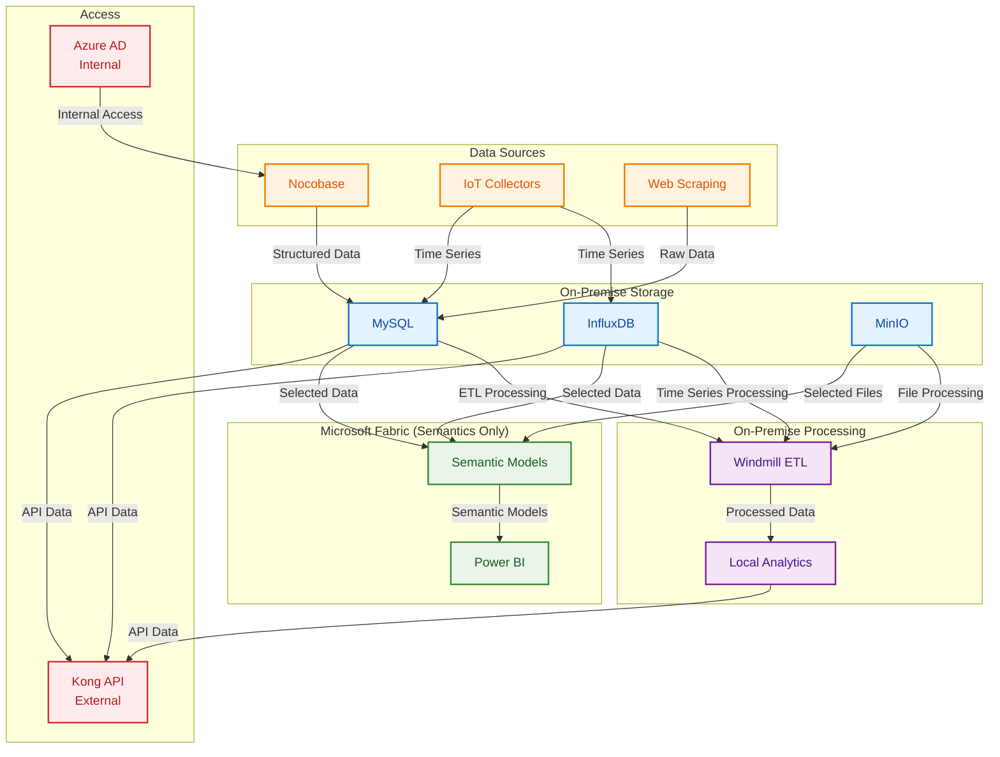

# Data Platform Architecture - On-Premise Implementation

## Overview

This document outlines the comprehensive on-premise data platform architecture designed and implemented to support our organization's data governance, pipeline automation, storage, visualization, and client access requirements. The system is built with modern on-premise technologies and follows best practices for data engineering and security, with only the semantic layer leveraging Microsoft Fabric for advanced analytics.

**Important Note**: This platform is implemented through collaboration between the Data Platform team and the Infrastructure team. The Infrastructure team manages the underlying infrastructure (servers, network, storage) while the Data Platform team provides requirements and manages the application layer.

## Team Collaboration Model

### Infrastructure Team Responsibilities
- **Server Management**: Provisioning and maintaining servers
- **Network Configuration**: Network setup, firewall rules, load balancers
- **Storage Management**: Storage allocation and backup infrastructure
- **Security Infrastructure**: Network security, SSL certificates, VPN access
- **Resource Monitoring**: Infrastructure monitoring and alerting
- **Disaster Recovery**: Backup and recovery infrastructure

### Data Platform Team Responsibilities
- **Application Architecture**: Design and maintain application architecture
- **Docker Configuration**: Manage docker-compose files and container orchestration
- **Application Deployment**: Deploy and configure applications
- **Data Management**: Database setup, data migration, data quality
- **Integration**: Microsoft Fabric integration and data synchronization
- **Application Monitoring**: Application-level monitoring and alerting

### Collaboration Points
- **Resource Requirements**: Data Platform team provides resource specifications
- **Network Requirements**: Data Platform team specifies network connectivity needs
- **Security Requirements**: Data Platform team defines security requirements
- **Deployment Coordination**: Joint planning for deployment schedules
- **Troubleshooting**: Collaborative problem-solving for infrastructure issues

## Architecture Philosophy

### On-Premise First Approach
- **Data Sovereignty**: All data processing and storage occurs on-premise
- **Security Control**: Complete control over data security and access
- **Compliance**: Enhanced compliance with data protection regulations
- **Cost Control**: Predictable costs without cloud vendor lock-in

### Hybrid Semantics Strategy
- **Microsoft Fabric**: Used exclusively for semantic modeling and advanced analytics
- **On-Premises Data Gateway**: Secure connectivity between on-premise data and Fabric
- **Power BI Integration**: Advanced dashboards leveraging semantic models
- **Selective Synchronization**: Only necessary data synchronized to Fabric

## Architecture Layers

### 1. Governance & Monitoring Layer

The top-level governance layer provides centralized control and management of the entire data platform using Open Metadata. This layer ensures data quality, compliance, and operational oversight across all system components.

**Key Components:**
- **Open Metadata**: Central metadata management and governance
- **Prometheus & Grafana**: System monitoring and alerting

### 2. Pipeline & Operation Layer

This layer handles automated data pipeline operations, including Extract-Transform-Load (ETL) processes from various data sources including IoT devices and applications, with data flowing to the on-premise data warehouse.

**Key Components:**
- **Windmill**: Primary workflow orchestration engine for ETL processes
- **Apache Airflow**: Alternative workflow automation tool (Not in Use)
- **GitLab**: Version control and CI/CD pipeline management (Not Available)

### 3. Data Sources & Ingestion Layer

This layer handles data collection and ingestion from various sources including IoT devices, web scraping, and external applications.

**Key Components:**
- **Nocobase**: Low-code application platform for data input and collection
- **Web Scraping Engine**: Converts websites into LLM-ready data
- **IoT Data Collectors**: Real-time data collection from IoT devices
- **API Integrations**: External data source connections
- **Data Validation**: Quality checks and data validation

### 4. Database & Storage Layer

The storage layer manages both structured and unstructured data with specialized components for different data types, all on-premise.

**Key Components:**
- **MySQL**: Primary relational database for structured data
- **MinIO**: Object storage for unstructured data and files
- **InfluxDB**: Time-series database for IoT and sensor data
- **MongoDB**: Document database for flexible schema data (Pending Implementation)

### 5. Hybrid Data Processing & Analytics Layer

This layer provides a hybrid approach with on-premise processing and cloud-based semantics.

**On-Premise Processing:**
- **Windmill**: ETL orchestration and data transformation
- **Local Analytics**: Real-time data processing and business logic
- **Data Quality**: Validation and quality checks

**Microsoft Fabric Integration (Semantics Only):**
- **Data Factory**: Limited to semantic model orchestration
- **Data Warehouse**: Semantic layer and data modeling
- **Data Engineering**: Advanced analytics and ML processing
- **Real-Time Analytics**: Streaming analytics for semantic insights
- **Power BI**: Interactive dashboards with semantic models

**On-Premises Data Gateway:**
- Secure data connectivity to Microsoft Fabric
- Data synchronization for semantic layer
- Incremental data updates
- Security and compliance controls

### 6. Visualization & Reporting Layer

This layer provides data visualization and business intelligence capabilities.

**On-Premise Visualization:**
- **Grafana**: Real-time monitoring dashboards
- **Custom Dashboards**: Internal business intelligence
- **Streamlit Applications**: Interactive data applications
- **Portainer Monitoring**: Infrastructure monitoring

**Microsoft Fabric Visualization (Semantics Only):**
- **Power BI**: Advanced semantic model dashboards
- **Fabric Reports**: Semantic layer reporting
- **Advanced Analytics**: ML-powered insights

**External Analytics Integration:**
- **Google Analytics**: Web traffic analysis and user behavior
- **Smartlook**: User session recording and heatmaps

### 7. IoT & Edge Computing Layer

This layer encompasses various IoT applications and edge computing services that generate and process data at the edge.

**Key Components:**
- **IoT Data Sources**: Various IoT devices and sensors including:
  - Smart City applications (Parking, Waste, Poles)
  - Smart Agriculture and Building systems
  - Healthcare and medical devices
  - People counting and traffic analytics
- **Edge Computing**: Local data processing and analytics

### 8. Application Layer

This layer contains various business applications and automation tools that support organizational operations.

**Key Components:**
- **n8n**: Workflow automation and integration platform
- **Dify**: AI application development platform
- **Internal Access**: All applications accessible via Azure AD

### 9. Development & Operations Layer

Development and deployment tools that support the platform's operational needs.

**Key Components:**
- **Portainer.io**: Container management for production and development environments
- **Streamlit**: Web application framework for data applications
- **GitLab CI/CD**: Automated deployment and testing
- **Monitoring Tools**: Application performance monitoring

### 10. Security & Access Management Layer

Security and access management layer that handles both internal and external access with proper authentication and authorization.

**Key Components:**
- **Kong API Gateway**: API management, routing, and rate limiting (External Access)
- **Azure AD**: Identity and access management with SSO (Internal Access)
- **Client Access**: Secure GUI access for authorized users
- **Network Security**: Firewall and intrusion detection (Infrastructure Team)

### 11. Web Presence & Analytics Layer

Web presence management with traffic tracking and tag management capabilities.

**Key Components:**
- **Google Tag Manager**: Tag management for static websites
- **Static Websites**: Various organizational websites (nccthailand, qsncc, EO website)
- **Web Analytics**: Traffic monitoring and user behavior analysis

## Resource Requirements Specification

### Infrastructure Requirements for Infrastructure Team

#### Server Specifications
```yaml
# Production Environment
servers:
  data_platform_main:
    cpu: 8 cores
    ram: 32GB
    storage: 500GB SSD
    network: 1Gbps
    
  data_platform_backup:
    cpu: 4 cores
    ram: 16GB
    storage: 1TB HDD
    network: 1Gbps

# Development Environment
servers:
  data_platform_dev:
    cpu: 4 cores
    ram: 16GB
    storage: 250GB SSD
    network: 1Gbps
```

#### Network Requirements
```yaml
# Network Configuration
network:
  internal_subnet: 192.168.1.0/24
  external_access: true
  vpn_required: true
  
# Port Requirements
ports:
  - 3306: MySQL
  - 8086: InfluxDB
  - 9000: MinIO
  - 8000: Windmill
  - 3000: Grafana
  - 8585: Open Metadata
  - 8000: Kong API Gateway
  - 8501: Streamlit
```

#### Storage Requirements
```yaml
# Storage Configuration
storage:
  database_storage: 200GB
  object_storage: 500GB
  backup_storage: 1TB
  log_storage: 100GB
```

## On-Premise Data Flow Architecture

### Core On-Premise Data Flow


*Simplified view showing main data flow from sources to on-premise storage and processing*



### Detailed On-Premise Architecture


*Complete 11-layer on-premise architecture with Microsoft Fabric semantics integration*

```mermaid
graph TB
    subgraph "Governance & Monitoring"
        OM[Open Metadata]
        PG[Prometheus & Grafana]
    end

    subgraph "Pipeline & Operation"
        WM[Windmill<br/>Primary ETL]
        AIR[Apache Airflow<br/>Not in Use]
        GL[GitLab<br/>Not Available]
    end

    subgraph "Data Sources & Ingestion"
        NOC[Nocobase]
        WSE[Web Scraping Engine]
        IOT[IoT Data Collectors]
        API[API Integrations]
    end

    subgraph "On-Premise Storage"
        MYSQL[MySQL]
        MINIO[MinIO]
        INFLUX[InfluxDB]
        MONGO[MongoDB<br/>Pending]
    end

    subgraph "On-Premise Processing"
        WM_PROC[Windmill Processing]
        LOCAL_ANALYTICS[Local Analytics]
    end

    subgraph "Microsoft Fabric (Semantics Only)"
        MF[Semantic Models]
        PBI[Power BI]
    end

    subgraph "On-Premise Visualization"
        GRAFANA[Grafana]
        STREAMLIT[Streamlit]
        CUSTOM[Custom Dashboards]
    end

    subgraph "IoT & Edge Computing"
        IOT_SOURCES[IoT Data Sources]
        EDGE[Edge Computing]
    end

    subgraph "Application"
        N8N[n8n]
        DIFY[Dify]
    end

    subgraph "Development & Operations"
        PORT[Portainer.io]
        ST[Streamlit]
        MON[Monitoring Tools]
    end

    subgraph "Security & Access"
        KONG[Kong API Gateway<br/>External]
        AAD[Azure AD<br/>Internal]
        NS[Network Security<br/>Infrastructure Team]
    end

    subgraph "Web Presence & Analytics"
        GTM[Google Tag Manager]
        SW[Static Websites]
        WA[Web Analytics]
    end

    %% Core On-Premise Data Flow
    IOT_SOURCES -->|Sensor Data| IOT
    IOT -->|Time Series| INFLUX
    IOT -->|Time Series| MYSQL
    NOC -->|Structured Data| MYSQL
    NOC -->|Files| MINIO
    NOC -->|Documents| MONGO
    WSE -->|Raw Data| MYSQL
    WSE -->|Files| MINIO
    API -->|Structured Data| MYSQL
    API -->|Documents| MONGO

    %% On-Premise Processing Flow
    MYSQL -->|ETL Processing| WM_PROC
    MINIO -->|File Processing| WM_PROC
    INFLUX -->|Time Series Processing| WM_PROC
    MONGO -->|Document Processing| WM_PROC
    WM_PROC -->|Processed Data| LOCAL_ANALYTICS

    %% Hybrid Semantic Flow
    MYSQL -->|Selected Data| MF
    MINIO -->|Selected Files| MF
    INFLUX -->|Selected Data| MF
    MONGO -->|Selected Documents| MF
    MF -->|Semantic Models| PBI

    %% On-Premise Visualization
    LOCAL_ANALYTICS -->|Real-time Data| GRAFANA
    LOCAL_ANALYTICS -->|Interactive Apps| STREAMLIT
    LOCAL_ANALYTICS -->|Business Intelligence| CUSTOM

    %% ETL Orchestration
    WM -->|ETL Orchestration| WSE
    WM -->|ETL Orchestration| IOT
    WM -->|ETL Processing| MYSQL
    WM -->|API Processing| KONG

    %% External API Access
    LOCAL_ANALYTICS -->|API Data| KONG
    MYSQL -->|API Data| KONG
    INFLUX -->|API Data| KONG
    MINIO -->|API Data| KONG
    MONGO -->|API Data| KONG

    %% Internal Access
    AAD -->|Internal Access| N8N
    AAD -->|Internal Access| DIFY
    AAD -->|Internal Access| NOC

    %% Application Data Access
    MYSQL -->|Structured Data| N8N
    MYSQL -->|Structured Data| DIFY
    INFLUX -->|Time Series Data| N8N
    INFLUX -->|Time Series Data| DIFY
    MINIO -->|File Storage| N8N
    MINIO -->|File Storage| DIFY
    MONGO -->|Document Data| N8N
    MONGO -->|Document Data| DIFY

    %% Governance & Monitoring
    OM -.->|Metadata Governance| WM
    OM -.->|Metadata Governance| MF
    PG -->|Monitoring| WM
    PG -->|Monitoring| MF

    %% Web Analytics
    SW -->|Traffic Data| WA
    SW -->|User Behavior| WA
    SW -->|Content| WSE
    SW -->|Analytics| WA

    %% Security & External Access
    PBI -->|Secure Access| KONG
    PORT -->|API Access| KONG
    GL -->|CI/CD| PORT

    %% Styling with better contrast
    classDef governance fill:#E8F5E8,stroke:#2E7D32,stroke-width:2px,color:#1B5E20
    classDef pipeline fill:#FFE6F2,stroke:#C2185B,stroke-width:2px,color:#880E4F
    classDef ingestion fill:#FFF3E0,stroke:#F57C00,stroke-width:2px,color:#E65100
    classDef storage fill:#E3F2FD,stroke:#1976D2,stroke-width:2px,color:#0D47A1
    classDef processing fill:#F3E5F5,stroke:#7B1FA2,stroke-width:2px,color:#4A148C
    classDef fabric fill:#E8F5E8,stroke:#388E3C,stroke-width:2px,color:#1B5E20
    classDef visualization fill:#FFF8E1,stroke:#FBC02D,stroke-width:2px,color:#F57F17
    classDef iot fill:#FFF8E1,stroke:#FBC02D,stroke-width:2px,color:#F57F17
    classDef devops fill:#FCE4EC,stroke:#C2185B,stroke-width:2px,color:#880E4F
    classDef security fill:#FFEBEE,stroke:#D32F2F,stroke-width:2px,color:#B71C1C
    classDef web fill:#E0F2F1,stroke:#00695C,stroke-width:2px,color:#004D40
    classDef application fill:#F1F8E9,stroke:#689F38,stroke-width:2px,color:#33691E

    class OM,PG governance
    class AIR,WM,GL pipeline
    class NOC,WSE,IOT,API ingestion
    class MYSQL,MINIO,INFLUX,MONGO storage
    class WM_PROC,LOCAL_ANALYTICS processing
    class MF,PBI fabric
    class GRAFANA,STREAMLIT,CUSTOM visualization
    class IOT_SOURCES,EDGE iot
    class N8N,DIFY application
    class PORT,ST,MON devops
    class KONG,AAD,NS security
    class GTM,SW,WA web
```



## Microsoft Fabric Integration Strategy

### Semantic Layer Only
The platform uses Microsoft Fabric exclusively for semantic modeling and advanced analytics, while keeping all data processing and storage on-premise.

**Key Benefits:**
- **Advanced Analytics**: Leverage Fabric's semantic modeling capabilities
- **Power BI Integration**: Rich interactive dashboards
- **Data Sovereignty**: Keep sensitive data on-premise
- **Cost Optimization**: Minimize cloud costs while maximizing value

**Integration Components:**
- **On-Premises Data Gateway**: Secure connectivity to Microsoft Fabric
- **Selective Synchronization**: Only necessary data sent to Fabric
- **Semantic Models**: Advanced business logic and calculations
- **Power BI Dashboards**: Interactive visualizations

### Data Synchronization Strategy
- **Incremental Updates**: Only changed data synchronized
- **Scheduled Sync**: Automated synchronization schedules
- **Data Validation**: Quality checks before synchronization
- **Error Handling**: Robust error handling and retry mechanisms

## Security Architecture

The platform implements a multi-layered security approach:

1. **On-Premise Security**: Complete control over data security and access
2. **API Gateway Security**: Kong API Gateway manages external API access
3. **Identity Management**: Azure AD provides centralized authentication
4. **Data Governance**: Open Metadata ensures data lineage and compliance
5. **Access Control**: Role-based access control for different user types
6. **Network Security**: Enhanced firewall and intrusion detection (Infrastructure Team)

## Data Flow Patterns

- **Green Lines**: On-premise data processing and storage
- **Blue Lines**: Microsoft Fabric semantic integration
- **Purple Lines**: Server-to-server integration
- **Red Lines**: External API access
- **Orange Lines**: Internal application access

## Technology Stack

### Governance & Monitoring
- Open Metadata (Central metadata management)
- Prometheus & Grafana (System monitoring)

### Pipeline & Orchestration
- Windmill (Primary ETL orchestration engine)
- Apache Airflow (Alternative automation - Not in Use)
- GitLab (Version control and CI/CD - Not Available)

### Data Sources & Ingestion
- Nocobase (Low-code application platform for data input and collection)
- Web Scraping Engine (LLM-ready data conversion)
- IoT Data Collectors (Real-time sensor data)
- API Integrations (External data sources)

### On-Premise Storage & Databases
- MySQL (Primary relational database)
- InfluxDB (Time-series database for IoT)
- MinIO (Object storage for files)
- MongoDB (Document database - Pending Implementation)

### On-Premise Processing
- Windmill (ETL orchestration and data transformation)
- Local Analytics (Real-time processing and business logic)
- Data Quality (Validation and quality checks)

### Microsoft Fabric Integration (Semantics Only)
- Data Factory (Semantic model orchestration)
- Data Warehouse (Semantic layer and data modeling)
- Data Engineering (Advanced analytics and ML processing)
- Real-Time Analytics (Streaming analytics for semantic insights)
- Power BI (Interactive dashboards with semantic models)
- On-Premises Data Gateway (Secure connectivity)

### On-Premise Visualization
- Grafana (Real-time monitoring dashboards)
- Streamlit (Interactive data applications)
- Custom Dashboards (Internal business intelligence)
- Portainer Monitoring (Infrastructure monitoring)

### IoT & Edge Computing
- IoT Data Sources (Various IoT devices and sensors)
- Smart City Applications (Parking, Waste, Poles)
- Smart Agriculture and Building systems
- Healthcare and medical devices
- People counting and traffic analytics

### Application
- n8n (Workflow automation and integration platform)
- Dify (AI application development platform)
- Internal Access (Azure AD authentication)

### Development & Operations
- Portainer.io (Container management)
- Streamlit (Data applications)
- GitLab CI/CD (Automated deployment)

### Security & Access
- Kong API Gateway (API management - External Access)
- Azure AD (Identity and access management - Internal Access)
- Network Security (Firewall and intrusion detection - Infrastructure Team)

### Web Presence & Analytics
- Google Tag Manager (Tag management)
- Static Websites (Organizational websites)
- Web Analytics (Traffic monitoring)

## Communication and Coordination

### 1. Regular Meetings

#### Weekly Status Meetings
- **Participants**: Data Platform team, Infrastructure team
- **Agenda**: 
  - Current status and issues
  - Upcoming changes
  - Resource requirements
  - Performance metrics

#### Monthly Planning Meetings
- **Participants**: Data Platform team, Infrastructure team, Stakeholders
- **Agenda**:
  - Capacity planning
  - Technology roadmap
  - Budget considerations
  - Risk assessment

### 2. Documentation and Knowledge Sharing

#### Shared Documentation
- **Architecture Documentation**: Both teams contribute
- **Runbooks**: Joint creation and maintenance
- **Troubleshooting Guides**: Collaborative development
- **Change Management**: Coordinated changes

#### Communication Channels
- **Slack/Teams**: Daily communication
- **Email**: Formal communications
- **Ticketing System**: Issue tracking and resolution
- **Wiki/Confluence**: Documentation repository

### 3. Escalation Procedures

#### Issue Escalation
1. **Level 1**: Data Platform team handles application issues
2. **Level 2**: Infrastructure team handles infrastructure issues
3. **Level 3**: Joint troubleshooting for complex issues
4. **Level 4**: Management escalation for critical issues

#### Change Management
1. **Change Request**: Submit change request with details
2. **Impact Assessment**: Both teams assess impact
3. **Approval Process**: Get necessary approvals
4. **Implementation**: Coordinated implementation
5. **Post-Implementation**: Review and documentation

## Implementation Notes

This on-premise architecture was designed to handle the complexity of modern data operations while maintaining data sovereignty, security, and operational efficiency. The hybrid approach with Microsoft Fabric for semantics ensures advanced analytics capabilities while keeping sensitive data on-premise.

The platform supports both real-time and batch processing requirements, with proper governance and monitoring throughout the data lifecycle. The modular design allows for independent scaling and updates of components as requirements change.

### Key Advantages of On-Premise Approach
- **Data Sovereignty**: Complete control over data location and access
- **Security**: Enhanced security controls and compliance
- **Cost Control**: Predictable costs without cloud vendor lock-in
- **Performance**: Optimized performance for local workloads
- **Compliance**: Easier compliance with data protection regulations

### Microsoft Fabric Benefits
- **Advanced Analytics**: Leverage cloud-based semantic modeling
- **Power BI Integration**: Rich interactive dashboards
- **Scalability**: Cloud-based semantic layer scales automatically
- **Cost Efficiency**: Pay only for semantic layer usage

### Team Collaboration Benefits
- **Clear Responsibilities**: Well-defined roles and responsibilities
- **Efficient Communication**: Regular meetings and communication channels
- **Shared Knowledge**: Collaborative documentation and knowledge sharing
- **Coordinated Changes**: Joint planning and implementation
- **Escalation Procedures**: Clear escalation paths for issues
