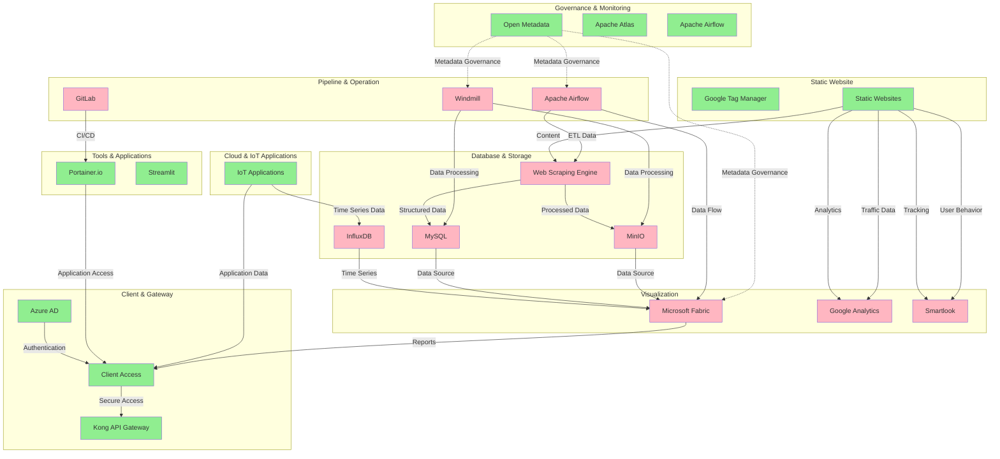

# Data Platform Architecture

## Overview

This document outlines the comprehensive data platform architecture I've designed and implemented to support our organization's data governance, pipeline automation, storage, visualization, and client access requirements. The system is built with modern cloud-native technologies and follows best practices for data engineering and security.

## Architecture Layers

### 1. Governance & Monitoring Layer

The top-level governance layer provides centralized control and management of the entire data platform using Open Metadata. This layer ensures data quality, compliance, and operational oversight across all system components.

**Key Components:**
- **Open Metadata**: Central metadata management and governance
- **Apache Atlas**: Data lineage and governance tracking
- **Apache Airflow**: Workflow orchestration and monitoring

### 2. Pipeline & Operation Layer

This layer handles automated data pipeline operations, including Extract-Transform-Load (ETL) processes from various data sources including IoT devices and applications, with data flowing to the data warehouse.

**Key Components:**
- **Apache Airflow**: Primary workflow orchestration engine
- **Windmill**: Alternative workflow automation tool
- **GitLab**: Version control and CI/CD pipeline management

### 3. Database & Storage Layer

The storage layer manages both structured and unstructured data with specialized components for web scraping and data processing.

**Key Components:**
- **Web Scraping Engine**: Converts websites into LLM-ready data
- **MySQL**: Primary relational database
- **MinIO**: Object storage for unstructured data
- **InfluxDB**: Time-series database for IoT data

### 4. Visualization Layer

This layer provides data visualization and business intelligence capabilities using Microsoft Power BI and related tools.

**Key Components:**
- **Microsoft Fabric**: Comprehensive data platform including:
  - Data Factory
  - Data Warehouse
  - Data Engineering
  - Real-Time Analytics
  - Power BI
- **Google Analytics**: Web traffic analysis
- **Smartlook**: User behavior tracking

### 5. Cloud & IoT Application Layer

This layer encompasses various IoT applications and cloud services that generate data for the platform.

**Key Components:**
- Exoskeleton
- SAR Sub-Cloud
- Smart Parking
- Smart Waste
- Smart Pole
- Smart Farm
- Smart Home
- Smart Office
- People Counting

### 6. Tools & Application Layer

Development and deployment tools that support the platform's operational needs.

**Key Components:**
- **Portainer.io**: Container management for production and development environments
- **Streamlit**: Web application framework
- **MySQL/MongoDB**: Additional database instances for applications

### 7. Client & Gateway Layer

Security and access management layer that handles both internal and external access with proper authentication and authorization.

**Key Components:**
- **Kong API Gateway**: API management and routing
- **Azure AD**: Identity and access management
- **Client Access**: Secure GUI access for authorized users

### 8. Static Website Layer

Web presence management with traffic tracking and tag management capabilities.

**Key Components:**
- **Google Tag Manager**: Tag management for static websites
- **Static Websites**: Various organizational websites (nccthailand, qsncc, EO website)

## Data Flow Architecture

## Security Architecture

The platform implements a multi-layered security approach:

1. **API Gateway Security**: Kong API Gateway manages all external access
2. **Identity Management**: Azure AD provides centralized authentication
3. **Data Governance**: Open Metadata ensures data lineage and compliance
4. **Access Control**: Role-based access control for different user types
5. **Secure Routes**: All client access goes through proper authentication channels

## Data Flow Patterns

- **Green Dashed Lines**: Secure client access via GUI with best practices
- **Purple Dashed Lines**: Server-to-server integration
- **Dark Purple Dashed Lines**: Metadata governance connections
- **Red Dashed Lines**: Direct access routes (not recommended)
- **Black Dashed Lines**: Planning and coordination flows
- **Black Double-Headed Lines**: Two-way communication

## Technology Stack

### Cloud Services
- Microsoft Fabric (Data Factory, Warehouse, Power BI)
- Azure AD (Identity Management)
- Google Analytics & Tag Manager
- Smartlook (User Analytics)

### On-Premise Infrastructure
- Nutanix (Infrastructure Platform)
- GitLab (Version Control)
- Portainer.io (Container Management)

### Data Technologies
- MySQL (Relational Database)
- InfluxDB (Time-Series Database)
- MinIO (Object Storage)
- MongoDB (Document Database)

### Orchestration & Automation
- Apache Airflow (Workflow Orchestration)
- Windmill (Alternative Automation)
- Apache Atlas (Data Lineage)

### Security & Access
- Kong API Gateway
- Azure AD
- Open Metadata

## Implementation Notes

This architecture was designed to handle the complexity of modern data operations while maintaining security, scalability, and operational efficiency. The system supports both real-time and batch processing requirements, with proper governance and monitoring throughout the data lifecycle.

The platform is built to accommodate future growth and technology evolution, with modular components that can be independently scaled and updated as needed.
